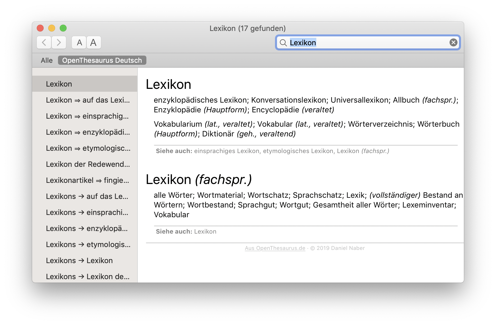

🇬🇧 [English Readme file](README.md)

## OpenThesaurus Deutsch Lexikon-Plug-in

_Version: 2024.05.14 -OS X 10.11 bis macOS 14_  
_Copyright © 2024 Wolfgang Kreutz und Daniel Naber_

Dieses Plug-in erweitert die Lexikon-App von macOS um einen **deutschen Thesaurus**.

Der vom Plug-in bereitgestellte Thesaurus basiert auf dem Online-Thesaurus [www.openthesaurus.de](https://www.openthesaurus.de/) von Daniel Naber.

Das Python-Skript zur Umwandlung der OpenThesaurus-Wörterbuchdatei in ein Apple-Lexikon-Plug-in wurde von Wolfgang Kreutz entwickelt.

**Updates und weiterführende Informationen:** [www.tekl.de](https://tekl.de)  
**Support und Quellcode:** [github.com/Tekl/openthesaurus-deutsch](https://github.com/Tekl/openthesaurus-deutsch)  
**Changelog:** [CHANGELOG.md](https://github.com/Tekl/openthesaurus-deutsch/blob/master/CHANGELOG.md)  
**Spende:** [PayPal](https://www.paypal.me/WolfgangReszel)

### Download

- [OpenThesaurus_Deutsch.dmg](https://github.com/Tekl/openthesaurus-deutsch/releases/latest/download/OpenThesaurus_Deutsch.dmg) (Disk Image mit dem Installationspaket)
- [OpenThesaurus_Deutsch_dictionaryfile.zip](https://github.com/Tekl/openthesaurus-deutsch/releases/latest/download/OpenThesaurus_Deutsch_dictionaryfile.zip) (das reine Lexikon-Plug-in als ZIP-Datei zur manuellen Installation)

### Installation

#### Per Installationspaket

1. Laden Sie die aktuelle Version des Plug-ins herunter:  [OpenThesaurus_Deutsch.dmg](https://github.com/Tekl/openthesaurus-deutsch/releases/latest/download/OpenThesaurus_Deutsch.dmg)
2. Öffnen Sie das Disk Image und starten das enthaltene Installations-Programm „OpenThesaurus Deutsch Installation“ per Doppelklick. Folgen Sie den Anweisungen.
3. Wenn Sie das Plug-in nicht für alle Benutzer, sondern lediglich für den aktuellen Benutzer installieren möchten, klicken Sie im Installer auf „Ort für die Installation ändern …“ und wählen dort „Nur für mich installieren“ aus.

#### Mit Homebrew installieren

Wenn Sie die Paketverwaltung [Homebrew](https://brew.sh/de) nutzen, können Sie die Installation mit diesem Terminal-Befehl anstoßen:

`brew install tekl/dictionaries/openthesaurus-deutsch`

Die Installation erfolgt stets in `~/Library/Dictionaries`.

Über `brew upgrade` werden dann auch automatisch Updates des Plug-ins installiert.

#### Manuelle Installation

1. Laden Sie die gezippte Wörterbuch-Datei direkt herunter und entpacken diese:  [OpenThesaurus_Deutsch_dictionaryfile.zip](https://github.com/Tekl/openthesaurus-deutsch/releases/latest/download/OpenThesaurus_Deutsch_dictionaryfile.zip)
2. Starten Sie das Programm „Lexikon.app“ und führen Sie den Befehl „Lexika-Ordner öffnen“ oder „Ordner Dictionaries öffnen“ im Menü „Ablage“ aus.  

3. Es öffnet sich nun ein Finder-Fenster, das den Ordner „Dictionaries“ zeigt. Ziehen Sie das entpackte Plug-in in dieses Finder-Fenster.  

4. Beenden und starten Sie die Lexikon-Anwendung, damit diese das neu installierte Plug-in erkennt. Rufen Sie die Einstellungen des Lexikons auf (⌘+Komma), scrollen Sie zum Eintrag „OpenThesaurus Deutsch“ und aktivieren Sie diesen.  

### Deinstallation

Das Plug-in entfernen Sie von Ihrem System, indem Sie das Installationsprogramm erneut ausführen und dort die Option „🚫 Deinstallieren“ ausführen.

Sie können das Plug-in auch von Hand aus dem Ordner `/Library/Dictionaries` oder `~/Library/Dictionaries` löschen und anschließend die Lexikon-Anwendung neu starten.

Falls Sie das Plug-in via Homebrew installiert haben, werden Sie es mit folgendem Befehl wieder los:

`brew uninstall openthesaurus-deutsch`

### Lexikon-Plug-in via Quellcode selbst generieren

#### Voraussetzungen

- [Xcode](https://apps.apple.com/de/app/xcode/id497799835?mt=12)
- [Dictionary Development Kit als Teil der Additional Tools](https://developer.apple.com/download/all/?q=Additional%20Tools) (kostenlose Entwickler-Account erforderlich)
- Das DDK muss in einem der folgenden Pfade installiert sein:
  - `/Developer/Auxiliary Tools/Dictionary Development Kit`
  - `/Developer/Utilities/Dictionary Development Kit`
  - `/Applications/Auxiliary Tools/Dictionary Development Kit`
  - `/Applications/Additional Tools/Utilities/Dictionary Development Kit`
  - `/DevTools/Utilities/Dictionary Development Kit`
  - `/Applications/Utilities/Dictionary Development Kit`
- Die Xcode Command Line Tools müssen installiert sein: `
 xcode-select --install`
- *Optional:* Für das Generieren des Installers benötigt man das kostenlose Tool [Packages](http://s.sudre.free.fr/Software/Packages/about.html)
- *Optional:* Um das Disk Image automatisch zu erstellen, benötigt man [DMG Canvas](https://www.araelium.com/dmgcanvas) (20 US-$).

#### Generierung im Terminal starten

- Terminal öffnen
- Mit `cd`in den Ordner `openthesaurus-deutsch-master`wechseln.
- Die Generierung mit `make` starten. Damit wird die aktuelle Wortliste von openthesaurus.de heruntergeladen, nach XML konvertiert und dann mit dem DDK in ein Lexikon-Plug-in konvertiert. Die Versionsnummer wird aus dem aktuellen Datum generiert und um **-beta** ergänzt.
- Die Umwandlung ist recht zeitintensiv und kann je nach Mac auch über eine Stunde dauern.
- Erscheint im Terminal der Prompt, installiert man das fertige Plug-in mit `sudo make install`. Das ist auch erforderlich, um den Installer zu erstellen. Dieser erwartet das Plug-in unter /Library/Dictionaries.
- Nach der Installation wird das Lexikon automatisch geöffnet und man kann das Plug-in aktivieren und testen.
- Das make-Kommando versteht folgende weitere Targets:
  - `make release`generiert das Plug-in ohne Endung „-beta“ bei der Versionsnummer.
  - `make dmg`packt das installierte **Beta**-Plug-in in einen Installer und diesen in ein Disk Image (bitte Voraussetzungen beachten). Das Makefile ist allerdings auf mein Entwickler-Zertifikat vorbereitet, man muss es also in der Zeile mit `packagesbuild`austauschen. Die fertigen Disk Images liegen im Ordner `releases`.
  - `make releasedmg`packt das installierte Plug-in ohne -beta-Zusatz bei der Versionsnummer in einen Installer und diesen in ein Disk Image (bitte Voraussetzungen beachten). Das Makefile ist allerdings auf mein Entwickler-Zertifikat vorbereitet. Das muss man in der Zeile mit `packagesbuild`austauschen.
  - `make notarize`schickt das zum aktuellen Datum passende Disk Image aus `releases`zur Notarisierung an Apple. Auch hier muss das Makefile bearbeiten und seinen Entwickler-Account bei `xcrun altool`hinter `--username`angeben. Das Password holt sich das Makefile aus dem Schlüsselbundeintrag `AC_PASSWORD`.
  - `make nhistory`zeigt den Notarisierungsstatus an. Besser, man wartet auf die Bestätigungs-Mail von Apple. 
  - `make nstaple`wendet bei erfolgreicher Notarisierung das Ticket auf das Disk Image an, womit es dann korrekt notarisiert und bereit für die Veröffentlichung ist.

### Lizenzen

- Der Inhalt des OpenThesaurus-Plug-ins unterliegt der [CC-GNU LGPL](https://creativecommons.org/licenses/LGPL/2.1/)
- Das Lexikon-Plug-in und die zur Erstellung verwendeten Skripte unterliegen der [GPLv3](https://www.gnu.org/licenses/gpl.html)  

  Dieses Programm ist freie Software. Sie können es unter den Bedingungen der GNU General Public License, wie von der Free Software Foundation veröffentlicht, weitergeben und/oder modifizieren, entweder gemäß Version 3 der Lizenz oder jeder späteren Version.  
  
  Die Veröffentlichung dieses Programms erfolgt in der Hoffnung, daß es Ihnen von Nutzen sein wird, aber OHNE IRGENDEINE GARANTIE, sogar ohne die implizite Garantie der MARKTREIFE oder der VERWENDBARKEIT FÜR EINEN BESTIMMTEN ZWECK. Detals finden Sie in der GNU General Public License.  
  
  Sie sollten ein Exemplar der [GNU General Public License](LICENSE) zusammen mit diesem Programm erhalten haben. Falls nicht, siehe https://www.gnu.org/licenses/.
