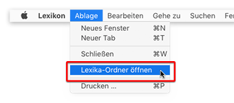

OpenThesaurus Deutsch Lexikon-Plug-in
-------------------------------------

_Version: 2020.03.16 - Mac OS X 10.6 bis macOS 10.14_ 
_Copyright © 2020 Wolfgang Reszel und Daniel Naber_

Dieses Plug-in erweitert die Lexikon-App von macOS um einen **deutschen Thesaurus**.

Der vom Plug-in bereitgestellte Thesaurus basiert auf dem Online-Thesaurus [www.openthesaurus.de](https://www.openthesaurus.de/) von Daniel Naber.

Das Python-Skript zur Umwandlung der OpenThesaurus-Wörterbuchdatei in ein Apple-Lexikon-Plug-in wurde von Wolfgang Reszel entwickelt.

**Updates und weiterführende Informationen:** [www.tekl.de](https://www.tekl.de). 
**Support und Quellcode:** [github.com/Tekl/openthesaurus-deutsch](https://github.com/Tekl/openthesaurus-deutsch) 
**Changelog:** [CHANGELOG.md](https://github.com/Tekl/openthesaurus-deutsch/blob/master/CHANGELOG.md) 
**Spende:** [PayPal](https://www.paypal.me/WolfgangReszel) 

### Installation

1. Laden Sie die aktuelle Version des Plug-ins herunter: [OpenThesaurus Deutsch.dmg](https://github.com/Tekl/openthesaurus-deutsch/releases/download/2019.04.15/OpenThesaurus_Deutsch.dmg)

2. Öffnen Sie das Disk Image und starten das enthaltene Installations-Programm „OpenThesaurus Deutsch Installation“ per Doppelklick. Folgen Sie den Anweisungen.

3. Wenn Sie das Plug-in nicht für alle Benutzer, sondern lediglich für den aktuellen Benutzer installieren möchten, klicken Sie im Installer auf „Ort für die Installation ändern …“ und wählen dort „Nur für mich installieren“ aus.

### Manuelle Installation ab Mac OS X 10.7

1. Laden Sie die Wörterbuch-Datei direkt herunter: [OpenThesaurus Deutsch.dictionary](https://github.com/Tekl/openthesaurus-deutsch/releases/download/2019.04.15/OpenThesaurus_Deutsch_dictionaryfile.zip)
2. Starten Sie das Programm „Lexikon.app“ und führen Sie den Befehl „Lexika-Ordner öffnen“ oder „Ordner Dictionaries öffnen“ im Menü „Ablage“ aus. 
    
3. Es öffnet sich nun ein Finder-Fenster, das den Ordner „Dictionaries“ zeigt. Ziehen Sie das heruntergeladene Plug-in in dieses Finder-Fenster. 
    
4. Beenden und starten Sie die Lexikon-Anwendung, damit sie das neu installierte Plug-in erkennt. Rufen Sie die Einstellungen des Lexikons auf (⌘+Komma), scrollen Sie zum Eintrag „OpenThesaurus Deutsch“ und aktivieren Sie diesen. 
    

### Manuelle Installation in Mac OS X 10.6

1. Laden Sie die Wörterbuch-Datei direkt herunter: [OpenThesaurus Deutsch.dictionary](https://github.com/Tekl/openthesaurus-deutsch/raw/master/objects/Dictionaries/OpenThesaurus Deutsch.dictionary)
2. Kopieren Sie das die heruntergeladene Datei in den Ordner `/Library/Dictionaries` (für alle Benutzer) oder `~/Library/Dictionaries` (für aktuellen Benutzer). Gegebenenfalls müssen Sie den Ordner anlegen.
3. Beenden und starten Sie die Lexikon-Anwendung, damit sie das neu installierte Plug-in erkennt. Rufen Sie die Einstellungen des Lexikons auf (⌘+Komma), scrollen Sie zum Eintrag „OpenThesaurus Deutsch“ und aktivieren Sie diesen.
4. Evtl. ist es nötig, den Mac neu zu starten oder den Prozess „DictionaryPanel“ in der Aktivitätsanzeige zu beenden, damit das Plug-in im Lexikon-Fenster (⌃⌘D) verfügbar ist.

### Deinstallation

Sie können das Plug-in auch von Hand aus dem Ordner `/Library/Dictionaries` oder `~/Library/Dictionaries` löschen und anschließend die Lexikon-Anwendung neu starten.

Lizenzen
--------

- Die Wortliste von OpenThesaurus unterliegt der [CC-GNU LGPL](https://creativecommons.org/licenses/LGPL/2.1/)

- Das Lexikon-Plug-in und die zur Erstellung verwendeten Skripte unterliegen der [GPLv3](https://www.gnu.org/licenses/gpl.html)  Dieses Programm ist freie Software. Sie können es unter den Bedingungen der GNU General Public License, wie von der Free Software Foundation veröffentlicht, weitergeben und/oder modifizieren, entweder gemäß Version 3 der Lizenz oder jeder späteren Version.  Die Veröffentlichung dieses Programms erfolgt in der Hoffnung, daß es Ihnen von Nutzen sein wird, aber OHNE IRGENDEINE GARANTIE, sogar ohne die implizite Garantie der MARKTREIFE oder der VERWENDBARKEIT FÜR EINEN BESTIMMTEN ZWECK. Detals finden Sie in der GNU General Public License.  Sie sollten ein Exemplar der [GNU General Public License](LICENSE) zusammen mit diesem Programm erhalten haben. Falls nicht, siehe <https://www.gnu.org/licenses/>.

